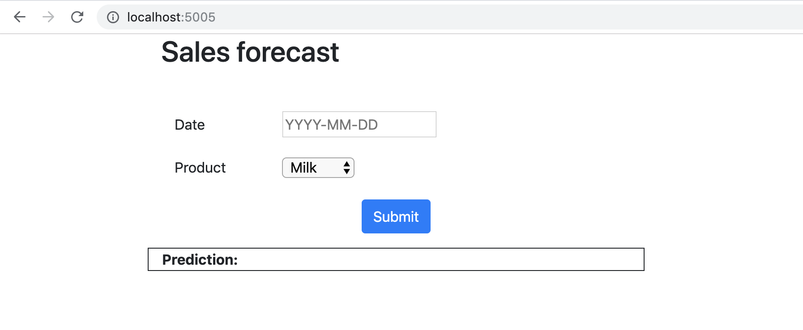

# Exercise 1: Local Environment Setup

## Goals

* Fork your copy of the repository in Github
* Configure a local containerized development environment by using a Docker image
* Test the application running locally

## Step by Step instructions

1. Visit the main repository at https://github.com/ThoughtWorksInc/continuous-intelligence-workshop and **fork it** to your personal GitHub account. **Don't
clone the main repository** (a copy of the repository is included in the Docker
image to save time and bandwidth).

2. Create a personal access token in GitHub:

  * Log in to Github
  * Open your [Personal Access Tokens](https://github.com/settings/tokens)
    settings (*Profile &rarr; Settings &rarr; Developer Settings &rarr; Personal
    Access Tokens*)
  * Click "Generate new token", choose a name and give it **repo** rights
  * Copy the access token value

3. Start the containerized development environment with Docker. You can copy the
image from the provided USB stick to save bandwidth or download it directly from
Docker Hub (if you do not have the stick):

  * **From the USB stick**: copy the file `cd4ml-setup.tar` from the USB stick
  to your computer on `<your-local-path>` and run:
    ```bash
    docker load --input <your-local-path>/cd4ml-setup.tar
    ```

  * **From Docker Hub**:
    ```bash
    docker pull dtsato/cd4ml-workshop-setup
    ```

4. Run the Docker container:

  * If you are running Docker on a **Windows machine**:
    ```bash
    docker run --platform linux --name cd4ml -d -p 5005:5005 dtsato/cd4ml-workshop-setup
    ```

  * If you are running Docker on a **Linux or Mac machine**:
    ```bash
    docker run --name cd4ml -d -p 5005:5005 dtsato/cd4ml-workshop-setup
    ```

5. Open a shell inside your container by running:
```bash
docker exec -it cd4ml bash
```

6. Once inside the container, go to the source code folder and configure Git
running the following commands (replace the placeholders between `<`and `>`):
```bash
cd app/continuous-intelligence
git remote set-url origin https://<github-username>:<token>@github.com/<github-username>/<your-forked-repository>
git config --global user.name "<your-name>"
git config --global user.email "<your-email>"
git pull --rebase
```

7. To test and see the application running locally, open a browser tab, go to
http://localhost:5005, and you should see the application like:

<kbd></kbd>

8. Done! Go to [the next exercise](./2-deployment-pipeline.md)
