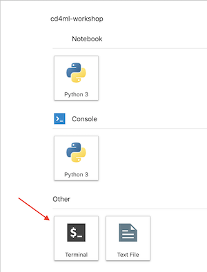

# Exercise 1: Development Environment Setup

## Goals

* Fork your copy of the repository in Github
* Login to your development environment in Jupyterlab
* Configure Git

## Step by Step instructions

We have provisioned all the infrastructure required for the workshop. Each
participant is assigned a numeric ID (from 1 to 100), which will be used
throughout the workshop.

1. Visit the main repository at https://github.com/ThoughtWorksInc/cd4ml-workshop
and **fork it** to your personal GitHub account. **Don't clone the main
repository**.

2. Create a personal access token in GitHub:

  * Log in to Github
  * Open your [Personal Access Tokens](https://github.com/settings/tokens)
    settings (*Profile &rarr; Settings &rarr; Developer Settings &rarr; Personal
    Access Tokens*)
  * Click "Generate new token", choose a name and give it **repo** rights
  * Copy the access token value

3. Go to Jupyter Lab at https://jupyterhub.cd4ml.net and login with the username
and password provided.

4. Open a terminal by clicking on the icon:

  <kbd></kbd>

5. Setup Git by running the following commands and answering the questions with
your details:

```bash
cd cd4ml-workshop
./setup-git.sh
```

6. To test and see the application running in production, open a browser tab, go
to http://userX.app.cd4ml.net (replace `X` with your user ID), and you should
see the application like:

<kbd></kbd>

7. Done! Go to [the next exercise](./2-deployment-pipeline.md)
