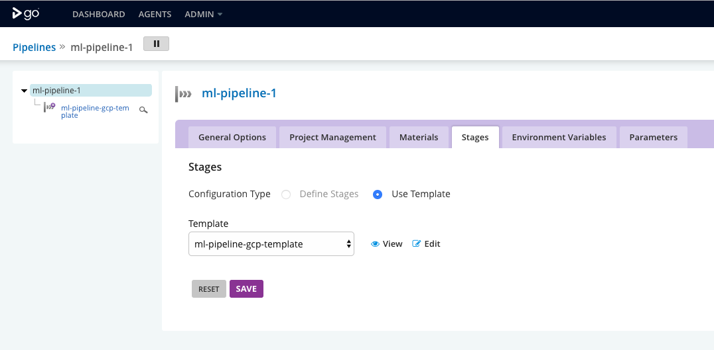
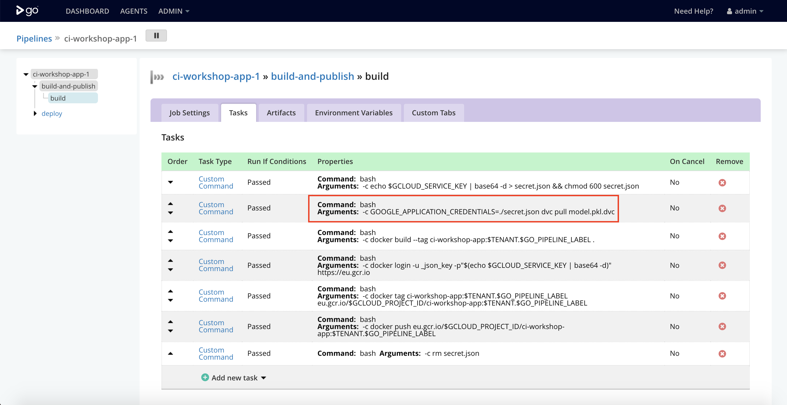

# Exercise 3: Create your Machine Learning Pipeline

## Goals

* Learn about [DVC](https://dvc.org/)
* Configure a Machine Learning Pipeline with DVC to fetch raw data and train a
ML model
* Create a pipeline in GoCD to automate your ML training pipeline
* Add automated tests to evaluate and govern your ML models
* Combine both GoCD pipelines to promote and deploy the new model to production

## Step by Step instructions

1. Configure DVC to use your GCP bucket for remote storage **(replace `X` with
  your user ID)**:
```bash
dvc remote modify default url gs://cd4ml-continuous-intelligence-bucket-X
```

2. Create your Machine Learning pipeline with dvc:
```bash
dvc run -f input.dvc -d src/download_data.py -o data/raw/store47-2016.csv python src/download_data.py
dvc run -f split.dvc -d data/raw/store47-2016.csv -d src/splitter.py -o data/splitter/train.csv -o data/splitter/validation.csv python src/splitter.py
dvc run -d data/splitter/train.csv -d data/splitter/validation.csv -d src/decision_tree.py -o data/decision_tree/model.pkl -M results/metrics.json python src/decision_tree.py
```

3. Add, commit, and push your changes:
```bash
git add .
git commit -m "Creating ML pipeline"
git push
```

4. Create machine learning training pipeline in GoCD:

  * Go to GoCD's [*"Admin" > "Pipelines"*](http://gocd.cd4ml.net/go/admin/pipelines)
  menu and create a new pipeline.

  * Configure your Github repository URL (e.g. `https://github.com/<github-user>/continuous-intelligence-workshop.git`) as a Git material.

  * Give it a name related to your username, e.g. `ml-pipeline-X`, replacing `X`
  with your user ID).

  * Click on *"Advanced Settings"* for "Part 2", enable the "Use Template"
  toggle and select the existing `ml-pipeline-gcp-template` template.

  <kbd></kbd>

  * Click *"Save + Run This Pipeline"*

5. Combine both pipelines:

  * Go back to edit your original `ci-workshop-app-X` pipeline again.

  * In the *"Materials"* tab add your new pipeline as a new material
  (double-click to get the correct auto suggestion).

  * Expand the *"build-and-publish"* stage, and click on the *"build"* job.

  * Update the second build task to pull the latest model using DVC instead of downloading a static version from Google Storage, by replacing the
  `python src/download_data.py --model` command with
  `GOOGLE_APPLICATION_CREDENTIALS=./secret.json dvc pull model.pkl.dvc`

  <kbd></kbd>

  * Save and go back to the main [Dashboard](http://gocd.cd4ml.net) page

6. Wait for the machine learning pipeline to train and publish your model.

**WARNING: The pipeline should fail because the model training accuracy is not
good enough!**

### Improving our Model

7. In your code, change the model training approach to use a Random Forest
algorithm, by editing the `src/decision_tree.py` file and replacing the `Model.DECISION_TREE` with `Model.RANDOM_FOREST` on the last line of the file.

8. Re-run your dvc pipeline locally:
```bash
dvc repro model.pkl.dvc
```

9. Add, commit, and push your changes, and watch your pipeline execute and go
green:
```bash
git add .
git commit -m "Improving model algorithm"
git push
```

10. Once the machine learning pipeline succeeds, it will trigger a new
application deployment pipeline, which will pull the new improved model and
deploy it to production. Visit your application again to verify that you get
better predictions!

11. Done! Go to [the next exercise](./4-tracking-experiments.md)
