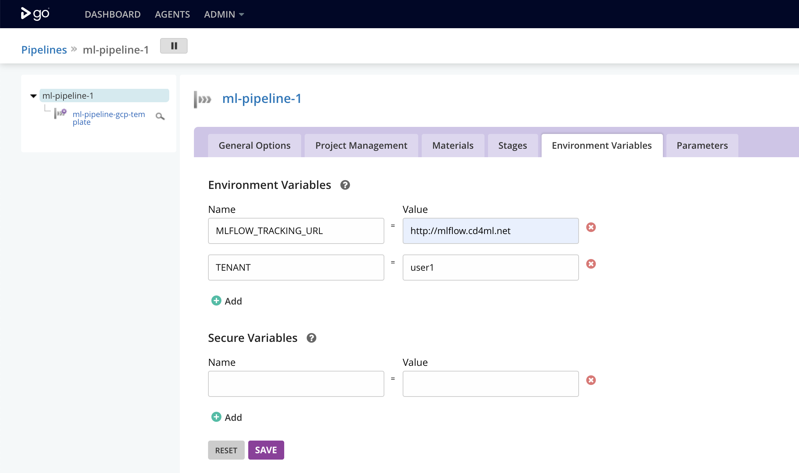
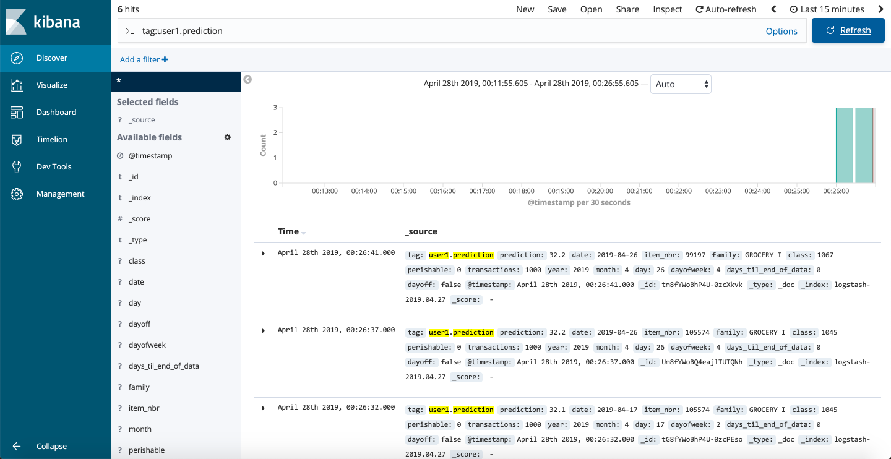

# Exercise 4: Tracking Experiments with MLflow

## Goals

* Learn about [MLflow](https://mlflow.org/)
* Configure our Machine Learning training Pipeline to track experiments and
results

## Step by Step instructions

1. In [GoCD](http://gocd.cd4ml.net), click on the little gear symbol
() next to `ml-pipeline-X` to edit your machine
learning pipeline configuration.

2. Open the *"Environment Variables"* tab and configure the URL to the MLFlow
tracking server and your tenant:

  * `MLFLOW_TRACKING_URL = http://mlflow.cd4ml.net`
  * `TENANT = userX` (replace `X` with your user ID)

  <kbd></kbd>

3. Save and return to the [Dashboard](http://gocd.cd4ml.net) page.

4. Trigger a new ML training pipeline and wait for it to succeed.

5. Visit the MLflow URL http://mlflow.cd4ml.net to find your experiment results.

<kbd></kbd>

6. Done! Go to [the next exercise](./5-model-monitoring.md)
