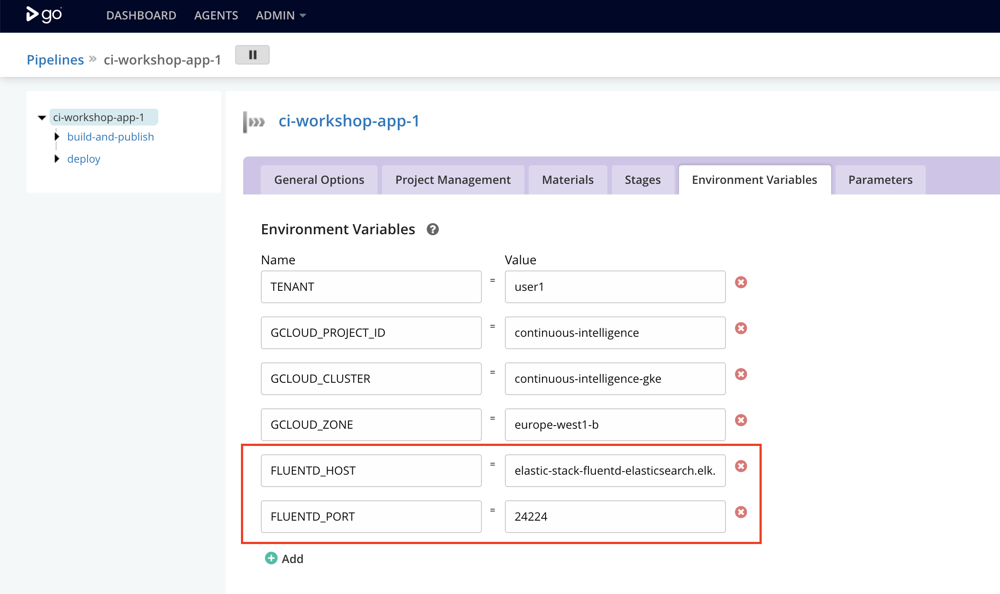

# Exercise 5: Model Monitoring and Observability

## Goals

* Learn about EFK Stack ([Elasticsearch](https://www.elastic.co/products/elasticsearch),
[FluentD](https://www.fluentd.org/), and [Kibana](https://www.elastic.co/products/kibana))
* Configure and deploy our application to log prediction events to Elastic Search
* Visualize events on Kibana dashboard
* Learn how to close the data feedback loop

## Introduction

To close the data feedback loop, we can log events in production to collect data
about how our model is performing against real data. This data can later be
curated and labeled to improve the dataset used during training. This allows us
to continuously improve our models in production!

In this workshop, we use the EFK stack for our monitoring and observability
infrastructure. It is composed of three main components:

* [Elasticsearch](https://www.elastic.co/products/elasticsearch): an open
source search engine.
* [FluentD](https://www.fluentd.org/): an open source data collector for unified
logging layer.
* [Kibana](https://www.elastic.co/products/kibana): an open source web UI that
makes it easy to explore and visualize the data indexed by Elasticsearch.

## Step by Step instructions

1. In [GoCD](http://gocd.cd4ml.net), click on the little gear symbol
() next to `ci-workshop-app-X` to edit your
deployment pipeline configuration.

2. Open the *"Environment Variables"* tab and configure the FluentD host and
port:

  * `FLUENTD_HOST = elastic-stack-fluentd-elasticsearch.elk.svc.cluster.local`
  * `FLUENTD_PORT = 24224`

  <kbd></kbd>

3. Save and return to the [Dashboard](http://gocd.cd4ml.net) page.

4. Trigger a new application deployment pipeline and wait for it to succeed.

5. Visit your application in production to make a few predictions.

6. Visit the Kibana URL http://kibana.cd4ml.net and click on the *"Discover"*
menu.

7. In the search field, find the entries tagged with your user, with a query
string `tag:"userX.prediction"` (substitute `X` with your user ID).

8. Click *"Refresh"* and you should see your predictions logged!

<kbd></kbd>

9. Done!

**NOTE: after the end of the workshop, we delete all the infrastructure and GoCD pipelines for security and cost reasons.**

You don’t need to use the same tools we chose to implement CD4ML. Get in touch
with us if you want to learn how to run this workshop with your teams in your
company!
